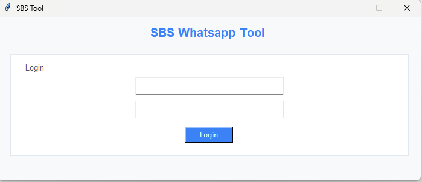
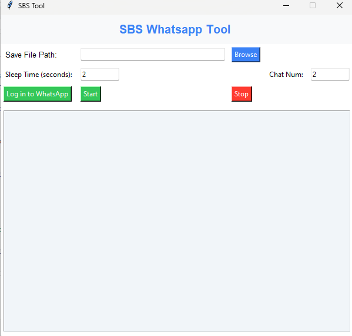

# Whatsapp-Tool-Extract-Message
This Application for extract/scrap messages and phone number from chats in whatsapp
This document explains the code for a Whatsapp Scraping Tool built using Python, Selenium, Tkinter (for GUI), and Google Sheets API. The tool is designed to scrap messages and phone number from Chats and save the extracted data to an Excel file.

## The tool allows the user to:

Log in to a Whatsapp account.
Select num of chat.
scrap messages and phone numbers.
Save the data to an Excel file.
Log messages for progress and errors during the scraping process.

## Libraries and Modules Used

- gspread: Interface with Google Sheets to fetch login credentials.
- tkinter: GUI for user interaction.
- selenium: Automates web browsing and scraping from Whatsapp.
- webdriver_manager: Manages Chrome WebDriver installation.
- pandas: Handles data manipulation and saves the scraped data to Excel.
- os and time: File and timing operations.
- re and urlparse: String manipulation and URL parsing.
- datetime: Handles timestamp for scraping logs.

## Login interface 
Here we connect to Googel sheet
that has columns

- Username
- Password

You need active API of Googel sheets and Googel Drive also you need create Credentials JSON file

## Scrap interface 

## What is the importance of this tool? 

We build this Tool to collect message to Analysis
and use this in marketing we can connect to persons who active in Groups and more .......
We integrates with an AI API(Chat-GPT) to filter and identify individuals who may be interested in investing in our business.

Best, 
Khaled Atef

[LinkedIn](https://www.linkedin.com/in/khaledaosman/)
